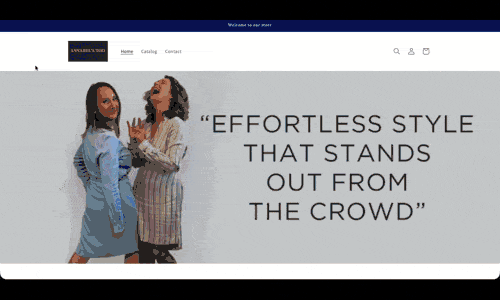

  
  
  

Creative, detail-oriented software engineer focused on UI consistency, responsive layouts, and user experience, with a strong interest in AI. Experienced in building successful front- and back-end web applications. Brings 12 years of technical experience in film and television production, delivering complex systems under tight deadlines while collaborating across multidisciplinary teams.

See [my website](https://surelyknott.co.uk) for more information.

  
<h1>Featured Projects</h1>

  <table bordercolor="#66b2b2">
    <tr>
      <td width="50%" valign="top">
        <h3 align="center">Matrix Wordle</h3>
         
        
         
        

          
          
        

        
<strong>HTML, CSS, JavaScript</strong> - Matrix Wordle is a Matrix-themed spin on the popular word game. I built it to test whether I could recreate Wordle’s mechanics from scratch.          

      </td>
      <td width="50%" valign="top">
        <h3 align="center">Stuffed Trailers</h3>
         
        
         
        

          
          
        

        
<strong>HTML, CSS, JavaScript</strong> - Stuffed Gourmet Trailers is an event catering brand. I delivered a high-end marketing site with a real-time booking flow and online deposits,           and helped shape the visual identity through logo design and original photography.
        

      </td>
    </tr>
    <tr>
      <td width="50%" valign="top">
        <h3 align="center">Pete Hills - Portfolio</h3>
         
        
         
        

          
          
        

        
<strong>HTML, CSS, JavaScript, Wordpress</strong> - Pete Hills needed a WordPress-based portfolio he could manage himself. I rebuilt the experience around a CMS workflow while                 modernizing the look and performance.
        

      </td>
      <td width="50%" valign="top">
        <h3 align="center">Annabels - Shopify</h3>
         
        
         
        

          
          
        

        
<strong>Shopify Admin, Excel, CSV Transform</strong> - Migrated 500+ products, variants, and inventory records from a legacy database into Shopify using CSV transformation and bulk             import tools.
        

      </td>
    </tr>
  </table>

  
<h1>More Projects</h1>

  <table bordercolor="#66b2b2">
    <tr>
      <td width="50%" valign="top">
        <h3 align="center">Project Five</h3>
         
        
         
        

          
          
        

        
<strong>Tech A, Tech B, Tech C</strong> - One-line summary of what this project does.

      </td>
      <td width="50%" valign="top">
        <h3 align="center">Project Six</h3>
         
        
         
        

          
          
        

        
<strong>Tech A, Tech B, Tech C</strong> - One-line summary of what this project does.

      </td>
    </tr>
  </table>

<h1 align="center">Technologies</h1>

  
  
  
  
  
  
  
  
  

---

<h1 align="center">Connect</h1>

  
  
  
  

<!--
**surelyknott/surelyknott** is a ✨ _special_ ✨ repository because its `README.md` (this file) appears on your GitHub profile.

Here are some ideas to get you started:

- 🔭 I’m currently working on ...
- 🌱 I’m currently learning ...
- 👯 I’m looking to collaborate on ...
- 🤔 I’m looking for help with ...
- 💬 Ask me about ...
- 📫 How to reach me: ...
- 😄 Pronouns: ...
- ⚡ Fun fact: ...
-->
